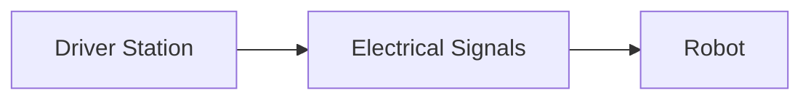
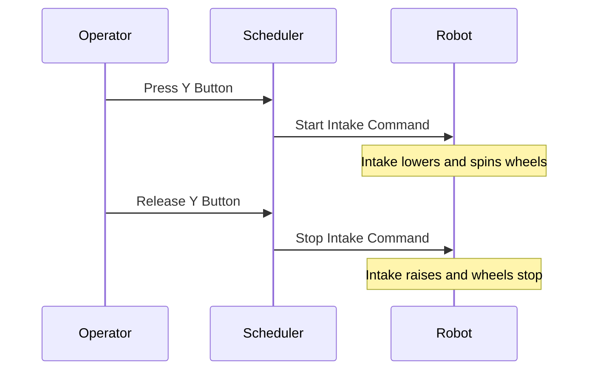

# Overview of Subsystems and Commands

Inspired by [Spectrum 3847](https://docs.google.com/presentation/d/e/2PACX-1vR-73OU1Q2f0C9cJMM9ZtX12QNSbEe2apapZbLYKaGS0XfJnP8J3QAU7D-1nZo5ITMpi3DTCwoR9Yh5/pub?start=false&loop=false&delayms=3000&slide=id.p)

The FIRST Robotics Competition (FRC) involves designing, building, and programming robots to perform specific tasks in a competitive environment. Understanding the logical structure of your robot is crucial for effective programming.

## Logical Structure of the Robot

At its core, an FRC robot consists of:

- **Driver Station**: Where operators control the robot using joysticks or buttons.
- **Electrical Systems**: Components like motor controllers, sensors, and actuators that translate signals into actions.
- **Robot**: The physical machine that interacts with the environment based on received commands.

In code, your robot is represented by:

- **Operator Interface**: Maps controls to specific actions.
- **Business Logic**: Determines how the robot responds to inputs (e.g., button presses).
- **Subsystems and Commands**: Define what actions the robot should perform.



## Command Based Programming


Command-Based Programming (CBP) is a design pattern that organizes your code into manageable parts, enhancing readability and maintainability. It’s ideal for FRC robots due to its structured approach.

### Key Components

1. **Subsystems**: Represent physical components of the robot. (ex. Drivetrain, Intake, Climber)
2. **Commands**: Define actions triggered by operator inputs or events. (ex. Intaking Game Piece, Drive with Controller, Do Nothing)
3. **Buttons/Triggers**: Map controls to specific commands via the Operator Interface. (ex. Y, joysticks)

## Subsystems

Subsystems are modules in your code that correspond to physical parts of the robot. They encapsulate all related components and behaviors, making the code modular. Examples include

- **Drivetrain**: Controls movement (e.g., wheels, motors).
- **Intake**: Manages game piece acquisition.
- **Indexer**: Holds onto the intaked game piece until it is time to score.
- **Climber**: Handles deploying and operating the climbing mechanisms.
- **Vision System**: Processes camera data for targeting and localization.

Subsystem are made up of physical components and behaviors.

1. Electrical Components
    - Motor Controls
    - Actuators (e.g., pneumatics, linear actuators)
    - Sensors (e.g., limit switches, encoders)

2. Behaviors
    - Methods that define actions the subsystem can perform. (ex. Raise/Lower Intake, Run Intake Wheel)
    - State variables that define what state the subsystem is in. (ex. Has Game Piece?)

Example Basic Python Code:
```python
class Drivetrain:
    def __init__(self):
        self.left_motor = Talon(1)
        self.right_motor = Talon(2)

    def arcade_drive(self, speed, turn):
        self.left_motor.set(speed + turn)
        self.right_motor.set(speed - turn)
```

## Commands

Commands are executable actions that interact with one or more subsystems. They can be triggered by operator inputs or event-based conditions.


Example Ctrl-Z Code:
```python
class Intake(Subsystem):
    def __init__(self, robot: "Robot"):
        super().__init__()
        self.robot = robot
        self.intake_motor = hardware.TalonFX(const.INTAKE_MOTOR_CAN_ID, "rio")
        self.pivot_motor = hardware.TalonFX(const.INTAKE_PIVOT_CAN_ID, "rio")
        intake_run = False

    def stop(self):
        self.intake_motor.stop() #These functions will have more detailed instructions for the motor
        self.pivot_motor.retract()

    def run(self):
        self.intake_motor.run_wheels()
        self.pivot_motor.lower()

    def periodic(self):
        if intake_run: #The intake_run flag is changed in the OI
            self.run()
        else
            self.stop()
```

Commands can be triggered in several ways:

**Button Press**: Execute a command when a specific button is pressed.

**Joystick Input**: Activate based on joystick positions or axes.

**Event-Based**: Initiate from sensor data (e.g., detecting a game piece).

## Operator Interface


The Operator Interface maps physical controls (buttons, joysticks) to specific commands. This is typically configured in the oi.py file.

Example Button Mappings in oi.py
```python
class OI:
    """
    Operator Input - This class ties together controls and commands.
    """
    def __init__(self, robot: "Robot"):
        self.robot = robot

        # Controllers
        self.driver1 = XboxCommandController(0)
        self.driver2 = XboxCommandController(1)

    @self.driver1.Y.whenHeld #Deploy Intake
        def _():
            self.robot.intake_run = True

    @self.driver1.Y.whenRelased #Retract Intake
        def _():
            self.robot.intake_run = False
```

Button Actions:

**On Press**: Trigger a command when the button is pressed.

**While Held**: Continuous action while the button is held down.

**On Release**: Execute another action or stop current commands.

## Command Scheduler

The Command Scheduler keeps track of currently running commands and checks if new commands should be started or stopped. The scheduler also restricts subsystems to running one command at a time. Here is an example of how the Command Scheduler starts a new command:



1. By default, the intake is run by the "Retract Intake" Command.
2. The operator starts holding down the Y button which is registered by the Command Scheduler.
3. The scheduler checks the oi.py file for mappings which have been set up for teh Y button and sees that when pressed it should run the "Intake Game Piece" Command.
4. The "Retract Intake" Command is stopped and the "Intake Game Piece" Command is started.
5. The operator releases the Y button which is registered by the Command Scheduler.
6. The "Intake Game Piece" Command is stopped and the default "Retract Intake" Command starts running.

The Command Scheduler watches for button presses or sensor inputs. It then starts new Commands and stops old Commands. The running Commands tell the Subsystems what to do.

Ctrl-Z uses a state machine framework so button presses put the robot into different "states" which then define what Commands need to be ran. This allows for more complex robot behaviors within and between subsystems.

